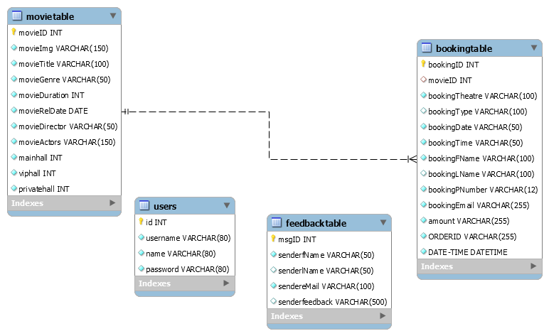

# Movie Ticket Booking System-PHP
Movie Ticket Booking System, back-end coded with PHP and front-end coded with Bootstrap, CSS, HTML, and Javascript and used MySql in the database.

The Movie Ticket Booking System facilitates the users to enquire about the
recent movies available movies, booking, and cancellation of movie tickets according
to theatre type and class type, enquire about the status of the booked tickets, etc.
The aim of this project is to design a website that gives an easy platform for
people to get details of trending films and to get movie tickets in the
easiest possible way making it simple for all to buy tickets from anytime
and anywhere.

## Github_theme

[Github_theme](https://aman05382.github.io/movie_ticket_booking_system_php/)

## Installation

For This Project I used [Wampp]

```php
1) Open PHPMyAdmin
2) import 'cinema_db.sql'
3) Open Connection.php and update db_name and password.
4) Go to admin Folder and Open config.php and update db_name and password.
```

## Usage

```bash
Admin Login Details

Username:- 123
Password:- 123
```

## Contributing
Pull requests are welcome. For major changes, please open an issue first to discuss what you would like to change.

Please make sure to update tests as appropriate.


##  IMAGES





